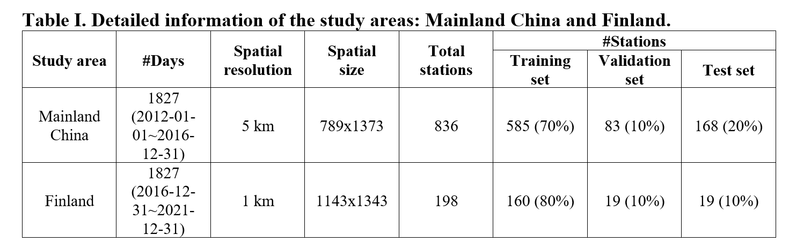
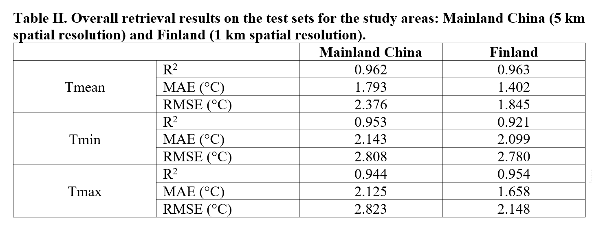

# LSTa

## Datasets

Since we do not have the permission to publish the Ta datasets measured in mainland China, we use the publicly available Ta datasets measured in Finland to illustrate how to use the code.

The detailed information for mainland China and Finland is available in Table I and Table II.





### Ta datasets

Please download the Ta datasets from the [GSOD](https://www.ncei.noaa.gov/access/metadata/landing-page/bin/iso?id=gov.noaa.ncdc:C00516) website. We provide a function (`utils/dl_gsod.py`) for you to download the datasets.

To obtain the Ta images:

- `utils/dl_gsod.py`: you will obtain the observed Ta which contains all the observed Ta worldwide.
- `utils/process_gsod.py`: filter the Ta measured in Finland. A square limitation (longitudes and latitudes) is applied, thus there are some stations may not really in but near Finland. You will obtain the `datasets/met/Ta_FI_raw.csv` file.
- `utils/interp.py`: You will obtain the Ta images and the related masks. The Ta images are the interpolated using the **Inverse Distance Weighting (IDW)** method. The mask files are also created to illustrate the pixels that contain the observed Ta. A `csv` file (`datasets/met/Ta_FI.csv`) that contains the related rows and columns for stations in the Ta images is also available after this step.

To save time, we provide the `Ta_FI.csv` for you: [Ta_FI.csv](https://github.com/cvvsu/LSTa/releases/tag/v0.0). Please download and save it under the `datasets/met` folder and execute the `utils/interp.py` file to obtain Ta and mask images.

The  `datasets/station_loc.csv` file contain the station locations (longitudes, latitudes, rows, cols) for stations in Finland. You can obtain this file by filtering the `state` column in `datasets/met/Ta_FI.csv`.

```python
df = pd.read_csv('datasets/met/Ta_FI.csv')
df_unique =  df[['state', 'longitude', 'latitude', 'row', 'col']].drop_duplicates()
df_FI = df_unique[df_unique['state'].str.contains(', FI')]
df_FI.to_csv('datasets/station_loc.csv', index=False)
```

### MODIS Aqua LST datasets

**STEP 1**

The MODIS Aqua LST datasets are available from the Google Earth Engine: [MYD11A1.061](https://developers.google.com/earth-engine/datasets/catalog/MODIS_061_MYD11A1#description). Download LST datasets from 2010-01-01 to 2021-12-31 using the `geemap` package. We provide a shapfile of Finland (under the folder `datasets/topo/`) for you to upload to the Google Earth Engine to download these images.

Note that the files will be downloaded to your google drive if scale is less than 5000. The unit of scale is meter. For more details, please refer to [geemap](https://geemap.org/).

To speed up, you can execute several `.py` files simultaneously and split the dates. For instance, you can download files from '2010-01-01' to '2011-01-01' and from '2011-01-01' to '2012-01-01' simultaneously.

```python
    Map = geemap.Map()

    ROI_ = ee.FeatureCollection('users/{your_user_name}/FI')
    ROI = ROI_.geometry()
    Map.centerObject(ROI)
    Map.addLayer(ROI, {}, 'FI')


    # LST
    bands = ['LST_Day_1km', 'QC_Day', 'LST_Night_1km', 'QC_Night']
    names = ['FI_Day', 'FI_QCD', 'FI_Night', 'FI_QCN']
    for band, name in zip(bands, names):
        dataset = ee.ImageCollection('MODIS/061/MYD11A1')\
                            .filter(ee.Filter.date('2010-01-01', '2022-01-01'))\
                            .select(band)\
                            .filterBounds(ROI)
        geemap.ee_export_image_collection_to_drive(dataset, folder=f'{name}', scale=1000, region=ROI, crs='EPSG:4326')
```

If there is no copyright problem, you may write an email to the authors to obtain the LST datasets.

- datasets
  - tif
    - LSTD
    - QCD
    - LSTN
    - QCN

**STEP 2**

Then, you need to convert the file format from `.tif` to `.npy` by applying the `utils/tif2npy.py` file.

We use an error level control of 1 k, but 3 k is also possible, and we find that 3 k will obtain better retrieval results. We use 1 k to illustrate that our method works well under the worst case.


- datasets
  - npy
    - LSTD
    - QCD
    - LSTN
    - QCN

### DataLoader

run the `datasets/LST2Ta_loader.py` to test whether you obtain the correct model inputs and outputs.


## Models

We use the `UNet` model, but other models are also available.

For the UNet model, you can choose single conv layer, double conv layer, or single conv with SE module. We find that different types of convs do not affect the retrieval results.

## Usage

**LST2Ta**

Options for `LST2Ta (running on one GPU)`:

`$ python main.py --name LST2Ta --model_name LST2Ta --dist none --epochs 200 --early_stop 120 --batch_size 8 --input_folders datasets/npy/LSTD datasets/npy/LSTN --output_folders datasets/Ta --input_nc 2 --output_nc 3 --val_ratio 0.1 --test_ratio 0.1 --pad_size 400 --lr 0.00016 --beta1 0.5`

To speed up training, you can choose distributed training: DP or DDP. Note that PyTorch has a new version of DDP, and we do not run on DDP. So, if you want to use DDP, it is on your own risk.

We use DP on a machine with 4 NVIDIA V100 GPUs, and thus the learning rate is accordingly 0.00004.

`pad_size` is applied to avoid overfitting. 

Simply add an option --isTest to obtain the retrieval results on the test set.


## License and Citation


Though MIT License is applied, you must cite our paper if you use our code (will be fully MIT once the manuscript has been published). 

```
@article{su2022lst2ta,
  title={Image-to-image training for spatially seamless air temperature retrieval with satellite images and station data},
  author={Su, Peifeng, and Abera, Temesgen, and Guan, Yanlong, and Pellikka, Petri},
  journal={Under review},
  volume={},
  pages={},
  year={2022},
  publisher={}
}
```


## Acknowledgment

Our code is inspired by [PyTorch CycleGAN](https://github.com/junyanz/pytorch-CycleGAN-and-pix2pix) code.
