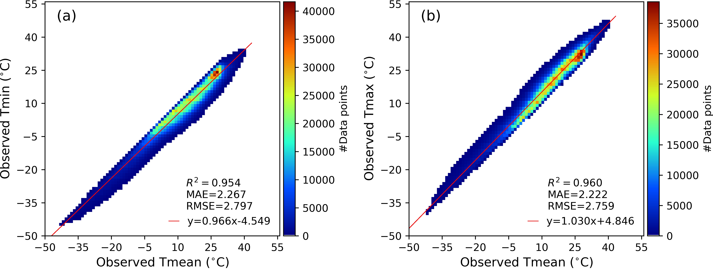
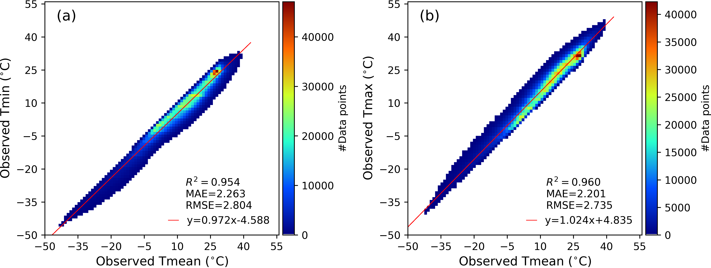
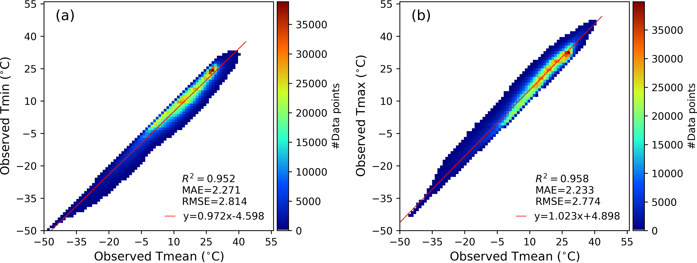
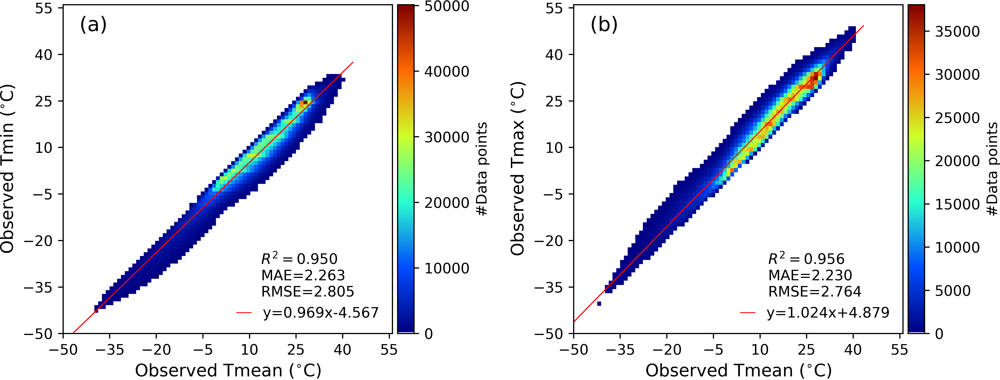
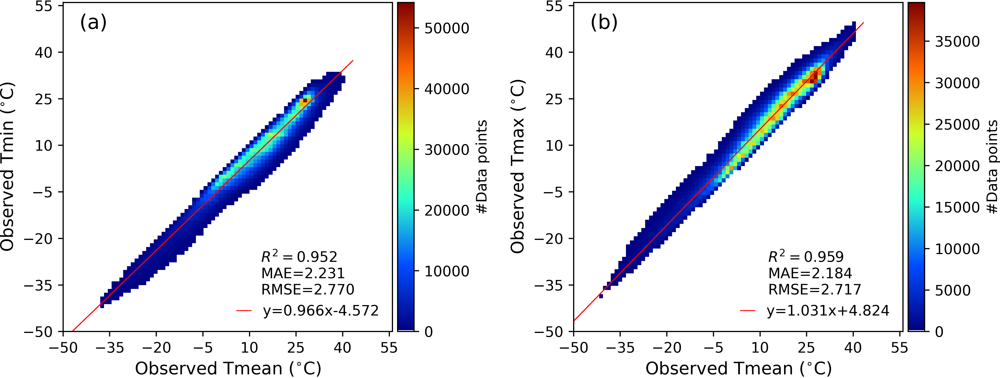

# Relationships between daily Tmean, Tmin, and Tmax collected in stations worldwide

Please check the `Ta_relationship_global.pdf` for the proof.

| Year | Relationship                             |
| ---- | ---------------------------------------- |
| 2012 |  |
| 2013 |  |
| 2014 |  |
| 2015 |  |
| 2016 |  |
